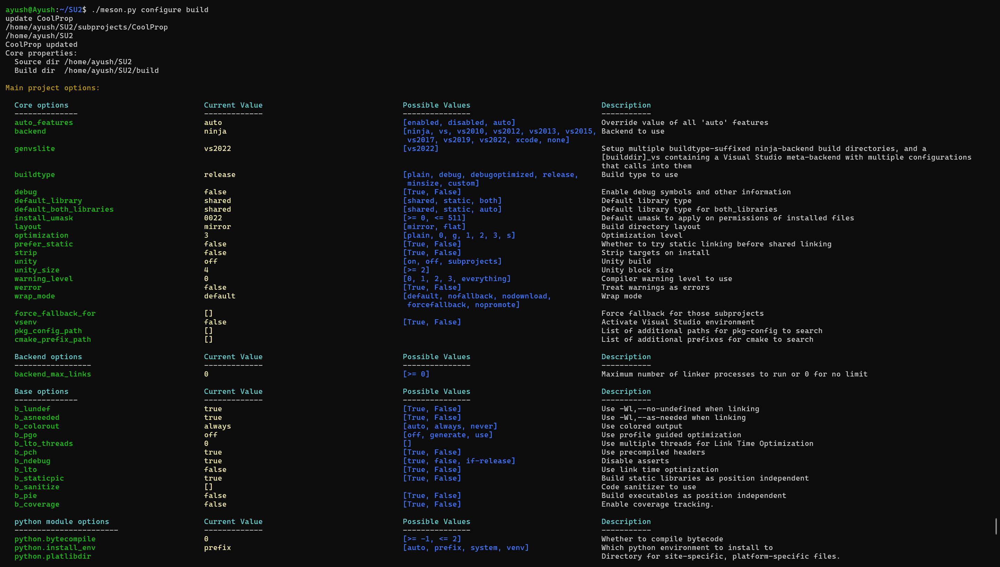
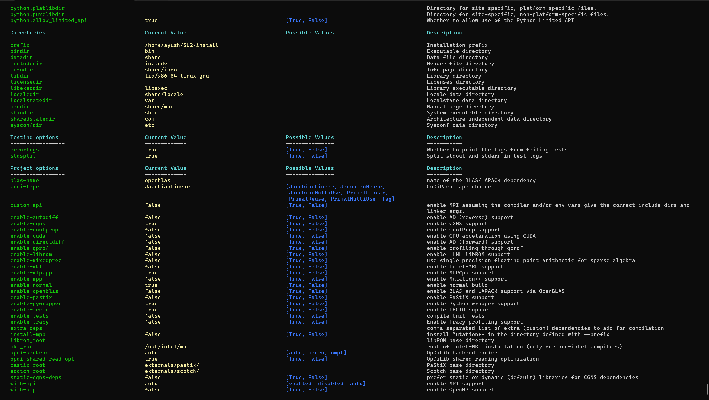
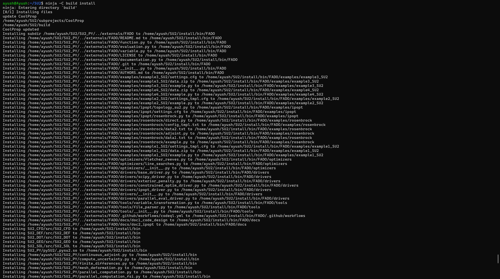
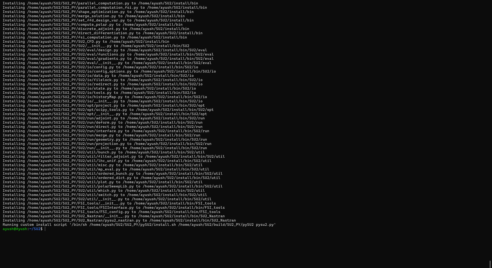

# Assignment 1: Compiling SU2 from Source

## Environment

- **Platform:** WSL2 (Ubuntu 22.04 LTS)  
- **Compiler:** gcc / g++  
- **Build Tools:** Meson (v0.61+) and Ninja  

---

## The Build Process

I compiled **SU2** with **MPI support for parallel processing** and **the Python Wrapper enabled**, as these are required for the later assignments.

### 1. Clone the Repository

First, I pulled the latest source from the `main` branch:

```bash
git clone https://github.com/su2code/SU2.git
cd SU2
```

---

### 2. Configure the Build

To configure the build, I used the following flags.  
I pointed the prefix to a local install folder to keep my WSL environment clean.

```bash
# Setting up the build directory
python3 meson.py build -Dprefix=$HOME/SU2/install -Dpython_wrapper=true -Denable-mpi=true
```

---

### 3. Compile and Install

```bash
# Compiling and installing to the prefix path
python3 meson.py compile -C build install
```

---

## Verification

Once the build finished, I ran several checks to confirm the binaries were functional and properly linked.

### 1. Solver Check

Verified that **SU2_CFD** starts correctly and reports the expected version.

```bash
SU2_CFD
```

---

### 2. Parallel Execution Check

Ran a quick MPI test to ensure the MPI configuration was working.

```bash
mpirun -n 2 SU2_CFD
```

---

### 3. Python Wrapper Check

Opened a Python shell and imported the wrapper module.

```python
import pysu2
```

Since it loaded without a `ModuleNotFoundError`, the **SWIG Python bindings are functioning correctly**.

---

## Deliverables

**Screenshot:**  
, ,  and   – contains the Meson configuration output, preprocessing stage, and final compilation logs.
