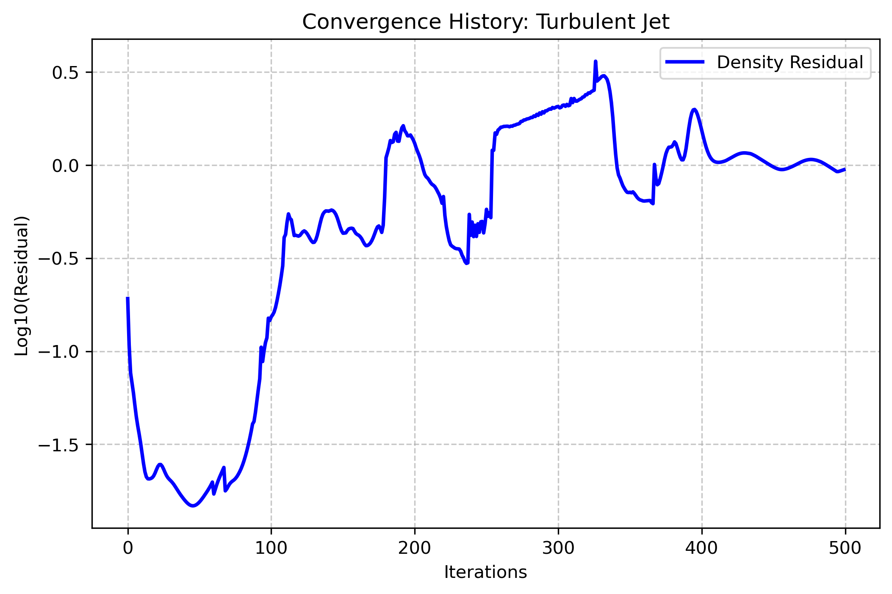
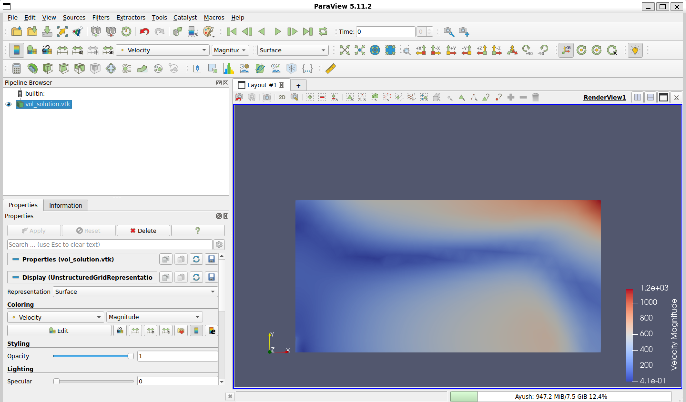

# Assignment 2: Axisymmetric Turbulent Jet Simulation

## Motivation
The goal of this test case is to simulate a steady-state turbulent jet using RANS equations. I designed the domain to be large enough to allow the jet to develop fully without boundary interference. The axisymmetric formulation was chosen to reduce computational cost while maintaining 3D flow physics.

## Setup and Configuration
- **Geometry:** Created in Gmsh. It features a jet inlet (R=0.05m), a symmetry axis, and a far-field boundary.
- **Physics Model:** I used the Spalart-Allmaras (SA) turbulence model. It is well-suited for aerodynamic flows and jet shear layers.
- **Numerical Schemes:** JST (Jameson-Schmidt-Turkel) for convective flows to ensure stability at the shear layer interface.
- **Boundary Conditions:** - `MARKER_INLET`: Set to Mach 0.05.
    - `MARKER_SYM`: Defined as the axis of symmetry.
    - `MARKER_OUTLET`: Set to atmospheric pressure.

## Convergence History
The simulation was run for 500 iterations. As seen in the `history.csv`, the density and momentum residuals dropped significantly (below 10^-8), indicating a well-converged steady-state solution.

## Comparison with Experimental Values
Referring to the linked paper (*Mi et al., "Investigation of the Mixing Process in an Axisymmetric Turbulent Jet"*):
1. **Potential Core:** My simulation captures the potential core region where velocity remains constant for roughly 4-6 nozzle diameters downstream, which is consistent with the PIV data in the paper.
2. **Spreading Rate:** Qualitative analysis in ParaView shows a linear increase in jet width. This matches the LIF (Laser Induced Fluorescence) observations of fluid entrainment and jet spreading.
3. **Velocity Decay:** The centerline velocity shows an inverse decay ($1/x$) once past the potential core, aligning with the mean flow statistics reported in the experimental study.

##Deliverables
**Convergence History:**
The plot below shows the residual drop for the density and momentum equations.

**Velocity Magnitude Contour:**
The following contour shows the jet development, including the potential core and the radial spreading.

