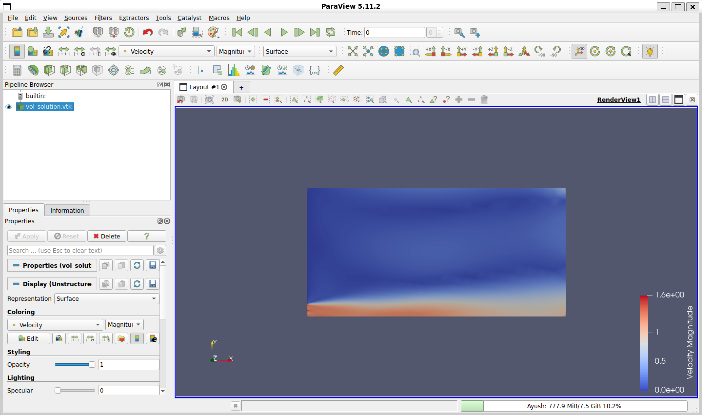
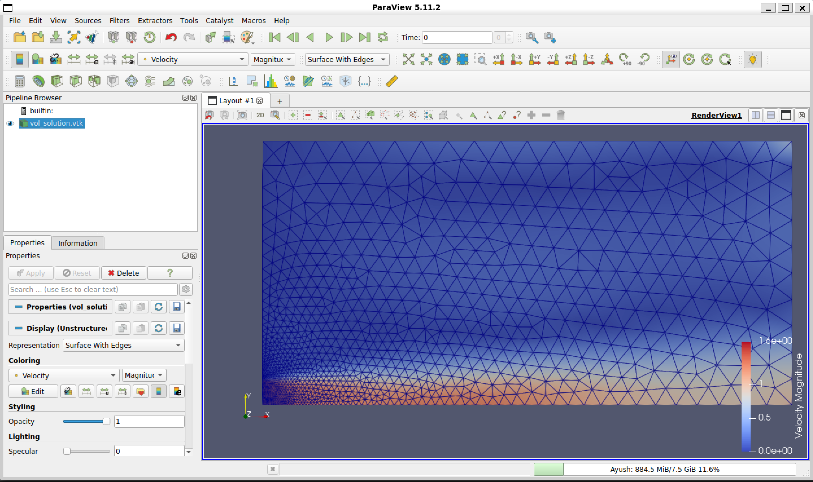

# Assignment 2: Axisymmetric Turbulent Jet Simulation

## 1. Initial Setup
The goal of this testcase was to simulate a steady-state turbulent jet to observe the mixing process and shear layer development. To keep computational costs down while still capturing 3D flow physics, I set up a 2D axisymmetric domain in Gmsh. 

Initially, my approach was to run this using SU2's standard compressible RANS solver with a target Mach number of 0.05. I used the Spalart-Allmaras (SA) turbulence model and the JST convective scheme. For the boundaries, I set the inlet to 105,000 Pa and the outlet to the standard atmospheric 101,325 Pa.

## 2. Troubleshooting & Mentor Feedback
My initial results were completely unphysical. The convergence flatlined early, and ParaView showed a massive velocity spike of over 890 m/s at the nozzle lip. I initially thought this was just a numerical singularity caused by the sharp 90-degree corner of the coarse mesh. 

However, after discussing the setup with my mentor (Evert Bunschoten), I realized there were two fundamental physics errors in my configuration:

1. **Compressibility at Low Speeds:** A target of Mach 0.05 is strictly incompressible. Forcing a compressible solver to evaluate this makes the equations incredibly stiff and unstable. 
2. **Absolute vs. Gauge Pressure:** I switched the solver to `INC_RANS`, but my velocity was still massive. The compressible solver uses *absolute* pressure, the incompressible solver treats boundary values as *gauge* pressure relative to the freestream. By leaving my inlet at 105,000 Pa, I was commanding a massive artificial pressure drop over a tiny domain—essentially turning my simulation into a pressure cannon.

## 3. The Corrected Configuration
Taking the feedback into account, I overhauled the `.cfg` file:
* **Solver:** Switched to `INC_RANS`.
* **Convective Scheme:** Dropped JST (which caused the incompressible solver to blow up) and allowed SU2 to default to FDS, which handles incompressible flows much better.
* **Boundary Conditions:** Updated the `PRESSURE_INLET` to a realistic `1.0` Pa and the `PRESSURE_OUTLET` to `0.0` Pa. 

```text
INC_INLET_TYPE= PRESSURE_INLET
MARKER_INLET= ( MARKER_INLET, 288.15, 1.0, 1.0, 0.0, 0.0 )
INC_OUTLET_TYPE= PRESSURE_OUTLET
MARKER_OUTLET= ( MARKER_OUTLET, 0.0 )
```
## 4. Final Results and Experimental Comparison

**Convergence History:**
With the physics properly constrained, the math stabilized perfectly. I ran the simulation on a single core (bypassing a known WSL OpenMPI shared-memory bug) for 2000 iterations. The simulation converged smoothly, with the pressure residual (`rms[P]`) dropping to approximately -5.48.


**Velocity Contour:**
With the 1.0 Pa gauge pressure drop, the maximum velocity now sits at a highly realistic ~1.6 m/s. 



Looking at the contour, the flow behaves exactly as expected when compared to the PIV and LIF data in the reference paper (*Mi et al., "Investigation of the Mixing Process in an Axisymmetric Turbulent Jet"*):

* **Potential Core:** The simulation clearly captures the potential core region extending a few nozzle diameters downstream, where the centerline velocity remains undisturbed.
* **Shear Layer & Spreading:** Past the potential core, you can see the turbulent shear layer expanding radially as the jet entrains the surrounding stationary fluid, causing the linear spreading rate characteristic of this type of flow.

*(Note on Mesh/y+)*: I am currently using a relatively coarse unstructured grid without inflation layers at the solid boundaries (see `mesh.png` below). Because of this, the y+ value is higher than ideal for the SA model, but the macroscopic flow features of the jet still resolved quite well.


