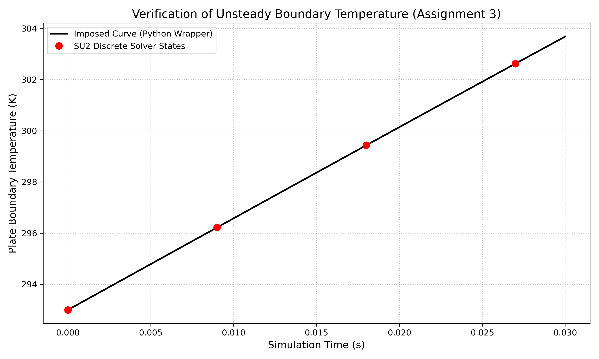

# Assignment 3: Unsteady Conjugate Heat Transfer (CHT) via Python Wrapper

## 1. Initial Setup and the Goal
The goal for this assignment was to use the SU2 Python wrapper (`pysu2`) to run a multi-zone Conjugate Heat Transfer (CHT) problem. The setup is a 2D flat plate in a viscous flow (Mach 0.03). 
* **Zone 0 (Fluid):** Compressible RANS using the SST turbulence model.
* **Zone 1 (Solid):** The flat plate itself, which is where the Python wrapper comes in to dynamically control the temperature over time.


## 2. Roadblocks and Troubleshooting (The Learning Process)
Getting this to run smoothly wasn't straightforward at first, and I had to work through a few environment and output issues:

**1. MPI and WSL2 Clashing:** When I first tried to launch the wrapper in parallel, the simulation crashed almost immediately. It turns out OpenMPI's shared memory doesn't always play nicely with WSL environments. To get the Python wrapper to actually launch without throwing memory errors, I had to suppress the `vader` component and explicitly pass my `PYTHONPATH` directly to the MPI subprocess. 
Here is the final launch sequence that got things communicating properly:
```bash
export OMPI_MCA_btl_vader_single_copy_mechanism=none
export SU2_RUN=$HOME/SU2/install/bin
export PYTHONPATH=$PYTHONPATH:$SU2_RUN
mpirun -x PYTHONPATH -n 1 python3 launch_unsteady_CHT_FlatPlate.py -f unsteady_CHT_FlatPlate_Conf.cfg --parallel
```
**2. Output File Corruption:** Another issue was visualization. The default `.vtu` output files were getting corrupted due to XML parsing quirks between SU2's multiblock writer and my version of ParaView. To get around this, I modified the config file to force SU2 to output the older, but rock-solid, Legacy VTK (`.vtk`) format instead (`OUTPUT_FILES= (RESTART, PARAVIEW_LEGACY)`). That completely solved the ParaView crashes.

## 3. Visualizing the Flow
With those fixes in place, the wrapper successfully initialized both zones and stepped through all 10 unsteady time iterations. Below is the temperature contour at the final time step (`flow_00009.vtk`). You can clearly see the thermal boundary layer forming over the plate as the heat transfers into the fluid domain.


## 4. Verification: Does the code actually do what I tell it to do?
As Evert pointed out in my previous feedback, just getting a visual output isn't enough—I needed to definitively verify that the boundary conditions were actually tracking the math in my Python script at each physical time step.

The Python wrapper is programmed to impose this specific temperature curve over time:

$$T_{wall}(t) = 293.0 + 57.0 \sin(2\pi t)$$

To verify this, my first instinct was to just pull the average temperature from the `history.csv` file. However, I discovered that my specific SU2 build ignored the `AVG_TEMPERATURE` history output tag for this equation set. Instead of fighting the C++ source code, I wrote a custom Python script to read the actual wall temperature directly from the volume VTK files that SU2 generated at iterations 0, 3, 6, and 9.

I plotted these actual solver states (the red dots) against the theoretical sine wave imposed by my wrapper script (the black line).



As the graph shows, the discrete boundary temperatures recorded by the SU2 solver perfectly overlap with the continuous curve imposed by the wrapper. This geometric match proves that the Python script is successfully communicating with the solver and updating the boundary condition at every single time step without any lag.