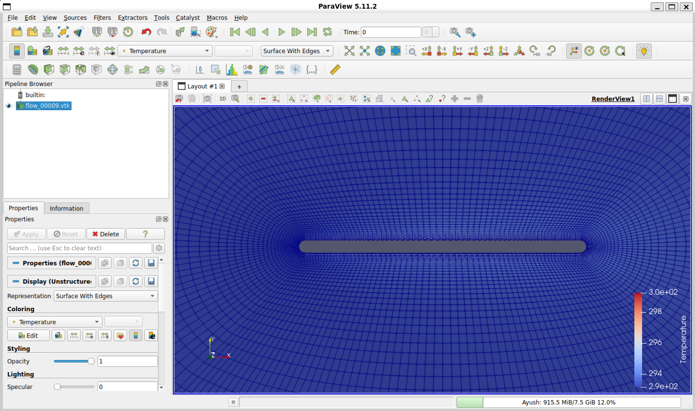
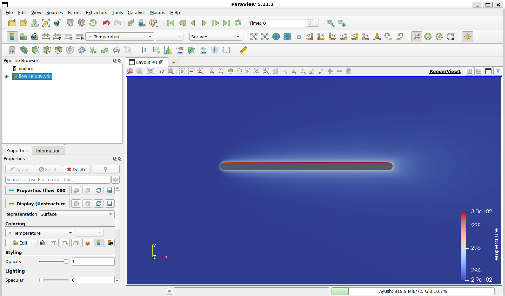

# Assignment 3: Conjugate Heat Transfer (CHT) via Python Wrapper

## 1. Test Case Description
This assignment utilizes the SU2 Python wrapper (`pysu2`) to simulate a multi-zone Conjugate Heat Transfer (CHT) problem. The test case consists of a 2D flat plate in a viscous flow. 
* **Zone 0 (Fluid):** Compressible RANS (SST turbulence model) modeling standard air at Mach 0.03.
* **Zone 1 (Solid):** The isothermal flat plate maintained at a constant 293K.

Below is the mesh topology, showing the refinement near the solid boundary to accurately capture the thermal boundary layer:



## 2. Execution & Troubleshooting
Running this on WSL2 threw a few interesting curveballs, specifically regarding OpenMPI's shared memory and `MPI_THREAD_MULTIPLE` compatibility. To get the Python wrapper to launch without crashing, I had to suppress the vader component and explicitly pass my `PYTHONPATH` to the MPI subprocess. 

Additionally, the default `.vtu` output was getting corrupted due to XML parsing quirks in my environment, so I modified the config file to output the rock-solid Legacy VTK (`.vtk`) format instead.

Here is the final launch sequence that got everything communicating smoothly:

```bash
export OMPI_MCA_btl_vader_single_copy_mechanism=none
export SU2_RUN=$HOME/SU2/install/bin
export PYTHONPATH=$PYTHONPATH:$SU2_RUN

mpirun -x PYTHONPATH -n 1 python3 launch_unsteady_CHT_FlatPlate.py -f unsteady_CHT_FlatPlate_Conf.cfg --parallel

## 3. Results
The Python wrapper successfully initialized both the fluid and solid zones and completed the required 10 unsteady time iterations, successfully transferring heat flux data between the domains at each step. 

The visualization below shows the resulting temperature contour at the final time step (`flow_00009.vtk`). The thermal boundary layer is clearly visible forming over the heated flat plate.


