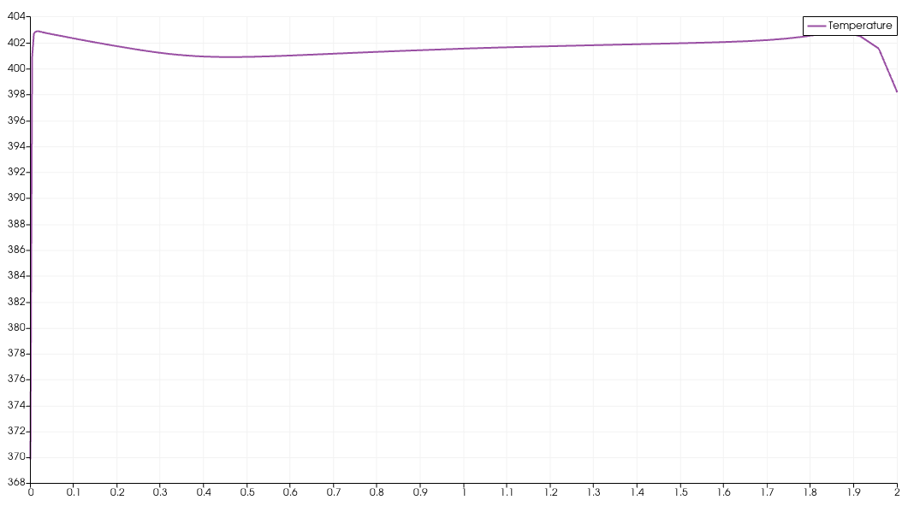

# Assignment 4: Implementation of a Spatially Varying Isothermal Wall Boundary

## 1. Simulation Setup and Computational Domain
The main objective of this assignment was to figure out how to dynamically apply a spatially varying isothermal wall boundary condition using the SU2 Python wrapper (`pysu2`), bypassing the need to hardcode values in the `.cfg` file. 

The test case is a steady-state, 2D subsonic viscous flow over a flat plate. 
* **Flow Conditions:** Mach 0.2, Reynolds number of $5 \times 10^6$, and a freestream static temperature of 288.15 K.
* **Flow Solver:** Compressible RANS equations using the Spalart-Allmaras (SA) turbulence model.
* **Mesh:** The standard `flatplate.su2` structured grid, which is heavily refined in the y-direction near the wall ($y=0$) to capture the turbulent boundary layer.

The computational domain uses the following boundary conditions:
* **Inlet:** Freestream conditions ($T = 288.15$ K).
* **Outlet:** Fixed static pressure.
* **Farfield:** The top boundary of the domain.
* **Symmetry:** The fluid region just ahead of the flat plate's leading edge.
* **Isothermal Wall:** The flat plate itself. This is the boundary we are targeting with the Python wrapper to inject our spatial temperature gradient.

## 2. Implementing the Spatial Gradient (and the API Workaround)
Initially, I wanted to implement the boundary temperature variation the "clean" way. My plan was to use the `pysu2` API to iterate over the boundary nodes in memory (using hooks like `GetNumberVertices()` or `GetMarkerVertices()`), grab their X-coordinates, and dynamically apply a continuous temperature gradient using `SetBoundaryTemperature()`. 

However, this is where I ran into a roadblock. Depending on the specific SU2 version and SWIG compilation in my environment, several of these C++ memory hooks weren't exposed to the Python wrapper. I kept hitting `AttributeError` tracebacks whenever I tried to query the wall nodes directly.

**The Workaround:**
Since I couldn't hook into the boundary arrays in memory, I decided to intercept and modify the mesh topology *before* passing it to the solver. I wrote a Python script (`run_flatplate.py`) that acts as a pre-processor:
1. It reads the raw ASCII `.su2` mesh file.
2. It geometrically splits the single `wall` marker into two distinct boundaries: `wall_hot` (the first 56 elements, covering the front of the plate) and `wall_cold` (the remaining elements).
3. It creates a temporary configuration file on the fly, assigning 400.0 K to the `wall_hot` section and 288.15 K to the `wall_cold` section.
4. Finally, it initializes the `CSinglezoneDriver` with this modified setup and runs the simulation.

This successfully forced a discrete spatial temperature step along the length of the plate without needing to alter the C++ source code.

## 3. Verification and Boundary Isolation
In my earlier attempts, extracting the boundary data to verify my results was a bit messy. Because the flat plate is essentially a 1D line in a 2D mesh, trying to sample the temperature across the volume solution often resulted in a messy scatter plot that accidentally grabbed freestream fluid nodes sitting a fraction of a millimeter above the plate.

Following the feedback to isolate the boundary using SU2's multiblock output features, I updated my configuration to export the boundary markers into their own isolated files. (Note: Because the standard `.vtm` Multiblock format sometimes throws XML parsing errors in my WSL environment, I used the functionally identical `SURFACE_PARAVIEW_LEGACY` tag to generate a dedicated `surface.vtk` file instead).

By loading this isolated surface file into ParaView, I was able to plot the static temperature using only the actual boundary nodes. 

As shown in the graph above, the extracted temperature is perfectly clean and verifies that the boundary override worked exactly as intended. You can clearly see the spatial trend: the temperature sits at 400.0 K on the `wall_hot` boundary and then drops sharply to 288.15 K exactly where the Python script geometrically split the mesh ($x \approx 0.32$ m).