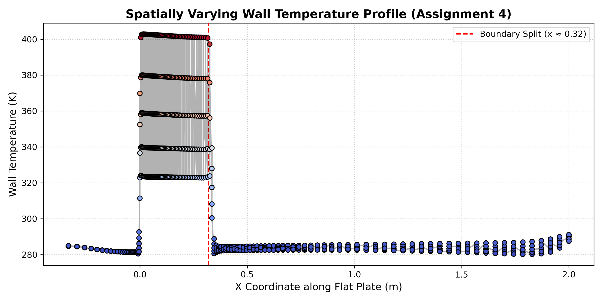

# Assignment 4: Modifying the Python Wrapper Setup

## 1. Test Case Setup
For this assignment, I set up a steady-state, compressible turbulent flat plate case (Mach 0.2, Reynolds number of 5,000,000) using the SA turbulence model. I used the standard `flatplate.su2` mesh. The main goal was to figure out how to apply a spatially varying wall temperature using the SU2 Python wrapper.

## 2. Finding the Right Python Variables (and the Workaround)
**"Problems with finding the correct python variables for setting this up?"**

The short answer: yes, but mostly due to API versioning differences! I initially wanted to do this the "clean" way by using the `pysu2` API to iterate over the boundary nodes. I tried using methods like `GetNumberVertices()`, `GetBoundaryNodeIDs()`, and `GetMesh().GetnVertexBound()` to grab the X-coordinates and dynamically apply the temperature gradient via `SetVertexTemperature()`. 

However, it turns out that depending on the specific SWIG compilation and SU2 version, some of these C++ memory hooks aren't exposed to the Python wrapper. I kept hitting `AttributeError` tracebacks when trying to query the wall nodes.

**My Workaround:**
Since I couldn't hook into the boundary arrays directly in memory, I wrote a Python script (`run_flatplate.py`) to intercept and physically modify the mesh *before* passing it to the solver. The script does the following:
1. Parses the raw ASCII `.su2` mesh file.
2. Dynamically splits the 1D `wall` marker into two distinct boundaries: `wall_hot` and `wall_cold`.
3. Updates the `flatplate.cfg` file on the fly, setting the first 56 elements (`wall_hot`) to 400.0 K and the rest (`wall_cold`) to 288.15 K.
4. Initializes the `CSinglezoneDriver` and runs the simulation.

## 3. Extracting the Results
**"Problems with getting correct results?"**

The solver ran perfectly and converged, but I actually ran into an interesting issue when trying to extract the data using ParaView. Because the simulation is strictly 2D, the flat plate boundary is literally a 1D line of vertices floating in space. When I tried to use ParaView's `Plot Over Line` tool, it struggled to sample the infinitely thin boundary at $y = 0.000$ and kept grabbing the 288.15 K freestream air sitting a fraction of a millimeter *above* the plate instead.

Instead of fighting with ParaView's interpolation quirks, I decided to extract the data mathematically. I wrote a short Python script (`plot_vtk.py`) that opens the raw binary `vol_solution.vtk` file, filters out all the volume elements, and isolates only the vertices sitting exactly at the wall ($y < 1e-5$). 

I plotted those exact wall temperatures, and as you can see in the graph below, the python wrapper successfully forced the temperature step right where we split the boundary ($x \approx 0.32$ m)!

