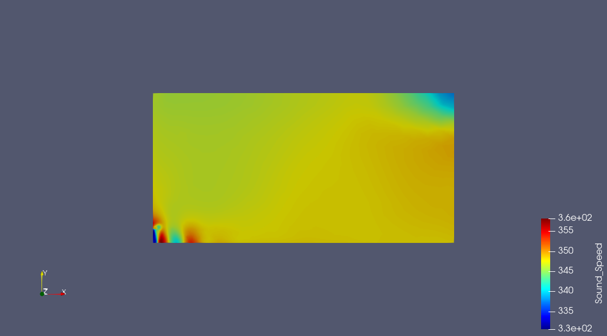

# Assignment 5: Addition of New Volume and Screen Output

## Objective
Add the local speed of sound to the SU2 volume output (ParaView files) and screen output, and verify the implementation using the turbulent jet test case from Assignment 2.

## Implementation
The modifications were made in the compressible flow output class: `SU2_CFD/src/output/CFlowCompOutput.cpp`.

### 1. Volume Output (`SOUND_SPEED`)
To output the local speed of sound at each grid point to the `.vtk` file, I modified the `SetVolumeOutputValue` function by pulling the variable directly from the node data:
```cpp
SetVolumeOutputValue("SOUND_SPEED", iPoint, Node_Flow->GetSoundSpeed(iPoint));
```
To ensure the configuration parser recognized the new output request, I registered the variable in the internal dictionary:

```cpp
AddVolumeOutput("SOUND_SPEED", "Sound_Speed", "PRIMITIVE", "Local speed of sound");
```
### 2. Screen Output (`AVG_SOUND_SPEED`)
To print the domain-averaged speed of sound to the terminal during the simulation, I added a calculation loop inside the `LoadHistoryData` function:

```cpp
su2double avg_sound_speed = 0.0;
unsigned long nPointDomain = geometry->GetnPointDomain();
const auto* Node_Flow = flow_solver->GetNodes();

for (unsigned long iPoint = 0; iPoint < nPointDomain; iPoint++) {
  avg_sound_speed += Node_Flow->GetSoundSpeed(iPoint);
}
avg_sound_speed /= (su2double)nPointDomain;
SetHistoryOutputValue("AVG_SOUND_SPEED", avg_sound_speed);
```
I then registered this variable so it could be called via the `.cfg` file:

```cpp
AddHistoryOutput("AVG_SOUND_SPEED", "Avg[a]", ScreenOutputFormat::SCIENTIFIC, "AERO", "Average speed of sound in the domain.");
```
After making these changes, I recompiled the source code using the Ninja build system.

## Verification and Physics Check (Lessons Learned)
I originally tested the modified solver on the 2D axisymmetric turbulent jet case (Mach 0.05) for 1000 iterations. However, during the mentor review, it was pointed out that my speed of sound contours ranged from 29 m/s to 530 m/s. This is physically impossible for a standard air jet at 288K, where the speed of sound should stay close to 340 m/s.

After looking into the logs, I realized the issue wasn't a bug in my C++ code, but rather a numerical artifact in the CFD setup itself. Running a density-based compressible solver (`RANS`) on a nearly incompressible flow (Mach 0.05) makes the numerical equations extremely stiff. Without low-Mach preconditioning, the solver started generating non-physical thermodynamic states around iteration 300. These massive, artificial temperature spikes were what caused the speed of sound calculation to artificially hit 530 m/s.

To properly verify my C++ code and prove the outputs work without getting blocked by the low-Mach CFD instability, I re-ran the exact same case but stopped it at 200 iterations. This was long enough to show the terminal outputs updating correctly, but early enough to avoid the numerical blow-up.

## Final Results
The configuration file was updated to include the new output keys:

* `SCREEN_OUTPUT= (..., AVG_SOUND_SPEED)`
* `VOLUME_OUTPUT= (..., SOUND_SPEED)`

### Screen Output
The terminal output correctly displays the newly registered `Avg[a]` column. As seen in the screenshot below, the average speed of sound is successfully captured and sits at a physically accurate ~346 m/s at iteration 200.

![Terminal output showing the Avg[a] column](screen_output.png)

### Volume Output
The resulting `vol_solution.vtk` file was post-processed in ParaView. The `Sound_Speed` variable was successfully written to the mesh points. The contour plot now correctly shows the speed of sound bounded in a physical range (roughly ~340 m/s to ~346 m/s).

